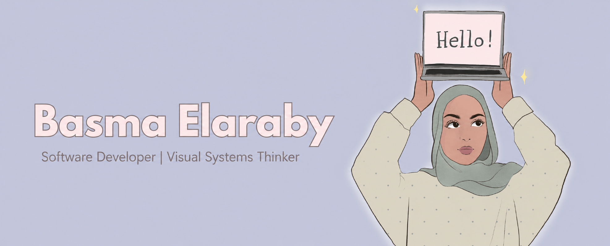

<!--  -->

# Hello! I'm Basma 👋🏼👒
I want to call myself a Creative Technologist because I’ve always been drawn to art, fashion, design, colors, and problem-solving! Blending creativity with technology is where I feel most energized.

I earned my Bachelor of Science in Computer Science from the University of Minnesota, and since then, I’ve been exploring how to integrate my technical background with my creative interests.

This GitHub is a reflection of my growth journey — a space where I learn, build, and create! 🤗

### My Portfolio Link
https://basmaelaraby.github.io/portfolio-website/ 
